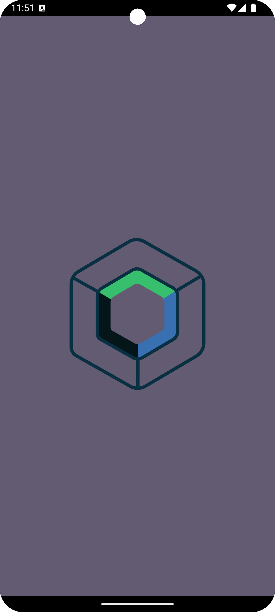
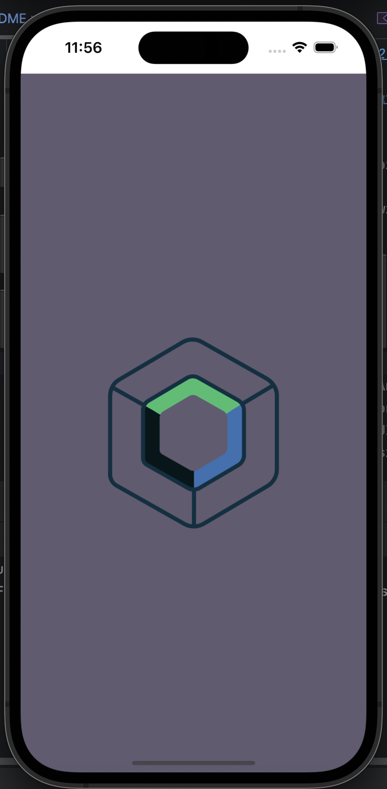
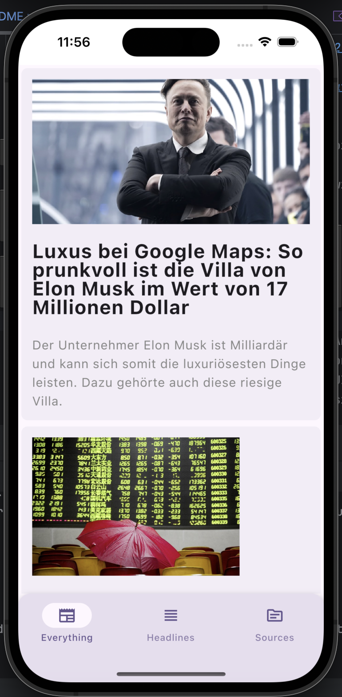
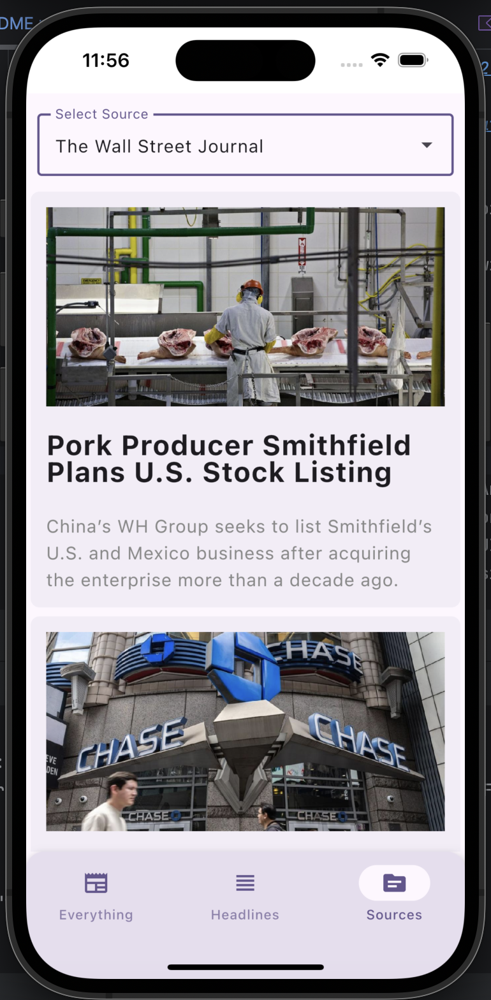

# KMP News Application

[](https://kotlinlang.org)

 


This is a Compose-based Kotlin Multiplatform mobile application. It follows best practices and uses MVVM and clean architecture patterns.

Kotlin Multiplatform (KMP) is a powerful feature of Kotlin that allows developers to share code between multiple platforms, including Android, iOS, web, and desktop. By writing common code once and using it across different platforms, KMP helps reduce code duplication and improve code maintainability. This approach allows you to focus on writing platform-specific code only where necessary, leading to a more efficient development process.

This app gathers news from various sources, offering the latest information on different topics. All news data comes from the reliable [News API](https://newsapi.org/), ensuring users get the most recent news articles from around the world.

## Show case:

### Android

<p>
  
  
  
  
</p>

### iOS

<p>
  
  
  
  
</p>

## Tech Stack:

- **Kotlin Multiplatform**: Share code between Android, iOS, and other platforms.
- **Kotlin Coroutines**: Simplify asynchronous programming with non-blocking code.
- **Compose Multiplatform**: Build declarative UIs for Android and other platforms.
- **Material3**: Implement Google's Material Design.
- **Ktor**: Make network requests.
- **Room**: Persist data locally in a SQLite database.
- **Datastore**: Store key-value pairs and typed objects.
- **Compose Navigation**: Handle in-app navigation.
- **Koin**: Implement dependency injection.
- **Coil**: Load images efficiently.

## Architecture

### MVVM (Model-View-ViewModel)

- **Model**: Represents the data and business logic of the application.
- **View**: Represents the UI components that display the data.
- **ViewModel**: Acts as a mediator between the Model and the View, handling the presentation logic and UI state.

### Clean Architecture

- **Presentation Layer**: Contains the UI components and ViewModels.
- **Domain Layer**: Contains use cases and business logic.
- **Data Layer**: Contains repositories and data sources (e.g., network and local storage).

## Best Practices

1. **Modularization**: Organize the code into modules to improve maintainability and reusability.
2. **Dependency Injection**: Use Koin for managing dependencies, making the code more testable and modular.
3. **Separation of Concerns**: Keep the business logic separate from the UI logic.
4. **Single Source of Truth**: Use ViewModel to store and manage UI-related data.
5. **Error Handling**: Implement proper error handling strategies to enhance user experience.
7. **Concurrency**: Use Kotlin Coroutines for handling asynchronous tasks efficiently.
8. **Responsive Design**: Ensure the app works well on different screen sizes and orientations.

## Getting Started

### Prerequisites

- **Android Studio**: Download and install from [here](https://developer.android.com/studio).
- **Kotlin**: Ensure you have Kotlin configured in your development environment.
- **Xcode** (for iOS development): Download and install from the Mac App Store.

### Installation

1. Clone the repository:

    ```bash
    git clone https://github.com/ashoktallapelli/CherryKMP.git
    ```

2. Open the project in Android Studio.

3. Sync the project to download all dependencies.

4. Build and run the app on your preferred device or emulator.

5. To get the data from API, you will need an API key from [News API](https://newsapi.org/). 


## Code References

- [Kotlin Multiplatform Samples](https://www.jetbrains.com/help/kotlin-multiplatform-dev/multiplatform-samples.html)
- [KMM PicSplash](https://github.com/cvivek07/KMM-PicSplash)